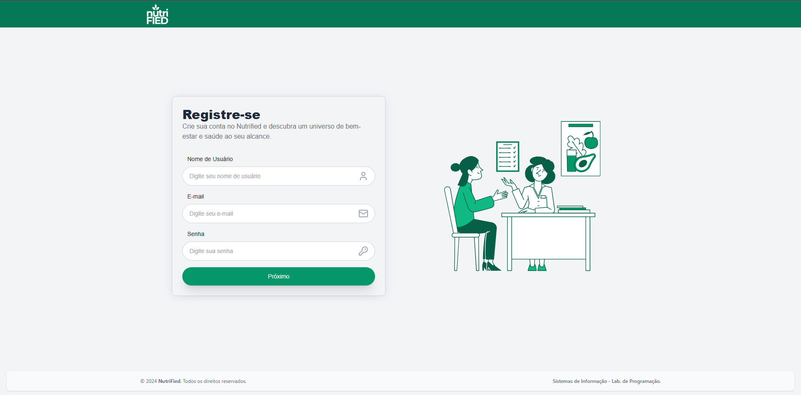
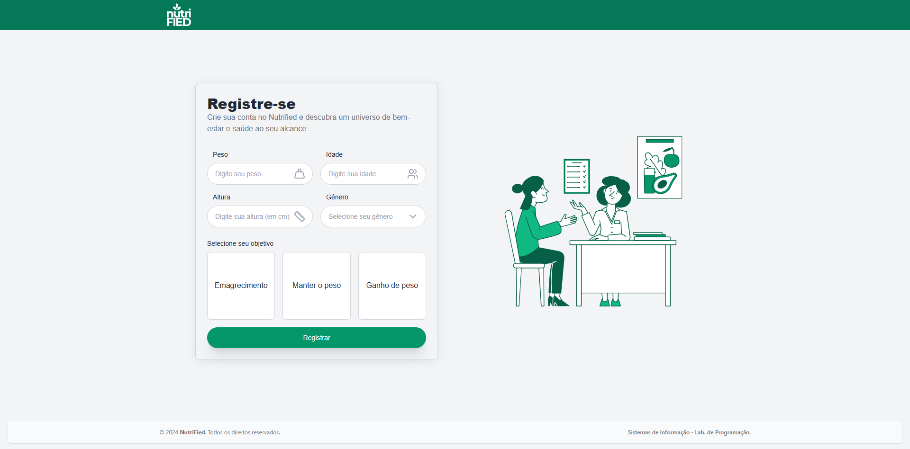
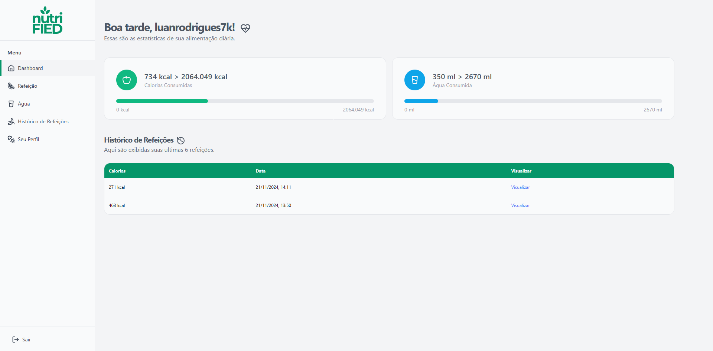
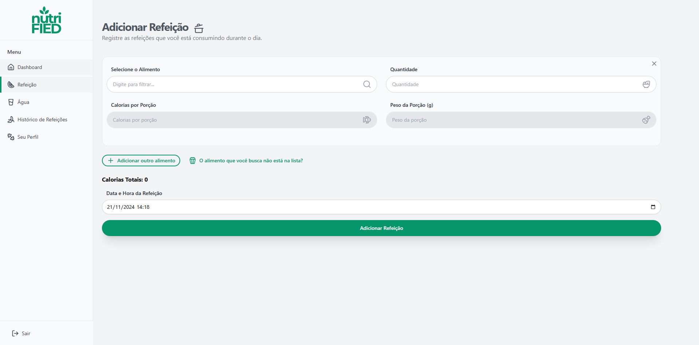
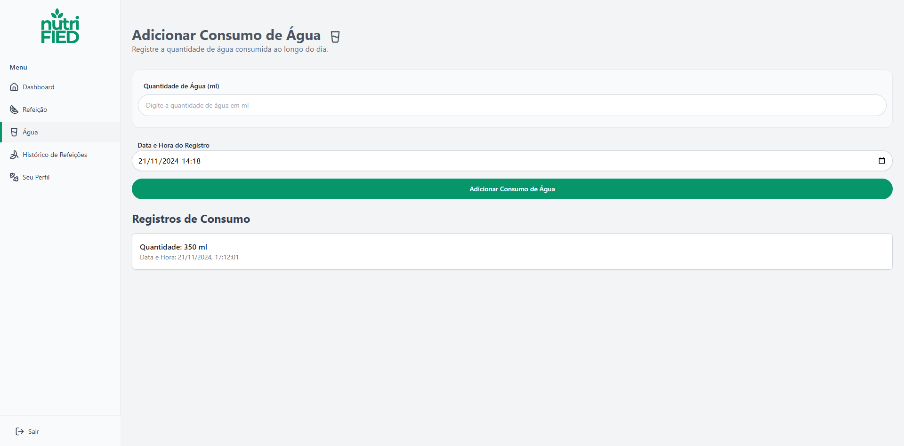
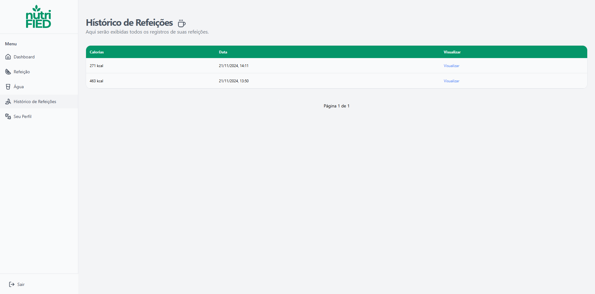
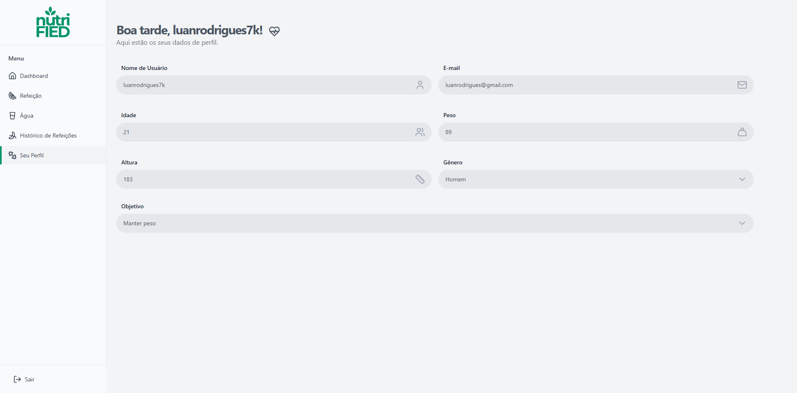

# NutriFied

**NutriFied** é um sistema web desenvolvido para ajudar usuários a monitorar suas necessidades de hidratação e alimentação, com funcionalidades como cadastro de refeições e consumo de água. Este repositório contém o frontend do projeto.

## Escopo do Projeto
- O usuário pode:
-  **Cadastrar informações pessoais**: peso, altura, idade, gênero e objetivo (manter, perder ou ganhar peso).
-  **Monitorar consumo diário**: registrar refeições e quantidade de água ingerida.
-  **Acompanhar relatórios**: visualização detalhada de consumo de água e refeições ao longo do tempo.

## Tecnologias utilizadas
-  **[Vite](https://vitejs.dev/)** para um ambiente de desenvolvimento.
-  **[React](https://react.dev/)** para criação da interface.
-  **[Tailwind CSS](https://tailwindcss.com/)** para estilização.
-  **[Yarn](https://yarnpkg.com/)** como gerenciador de pacotes.
  
## Como Rodar o Projeto

### Pré-requisitos
Certifique-se de ter o [Node.js](https://nodejs.org/) e o [Yarn](https://yarnpkg.com/) instalados em sua máquina.

### Passo a Passo
1. Clone o repositório: 
`git clone https://github.com/luanrodriguestavares/nutrified-frontend.git`

2. Entre no projeto:
`cd nutrified-frontend`

3. Instale as dependências:
`yarn install`

4. Inicie o servidor de desenvolvimento:
`yarn run dev`

5. Acesse a aplicação no navegador em http://localhost:5173

## Requisitos

Este sistema depende de um backend para funcionamento completo. Certifique-se de configurar e rodar o backend antes de usar o frontend.

-   **Repositório do Backend**: [NutriFied Backend](https://github.com/luanrodriguestavares/nutrified-backend)

## Capturas de Tela

